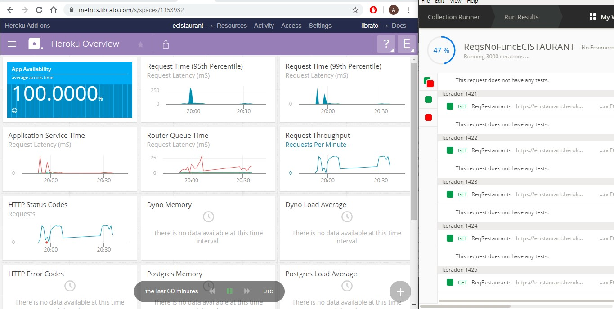
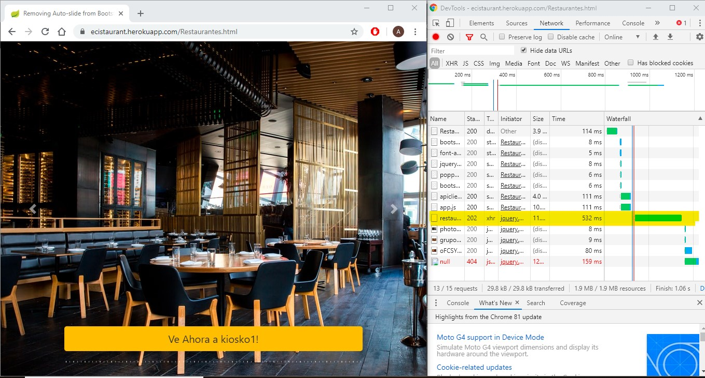
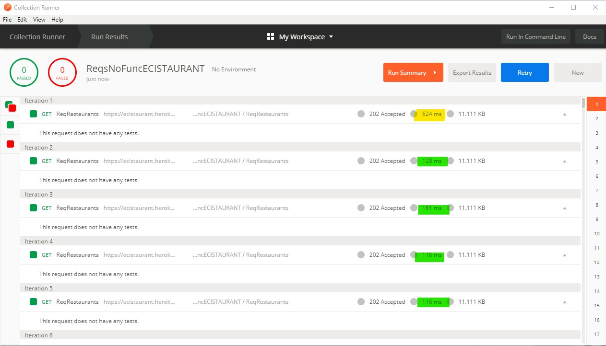
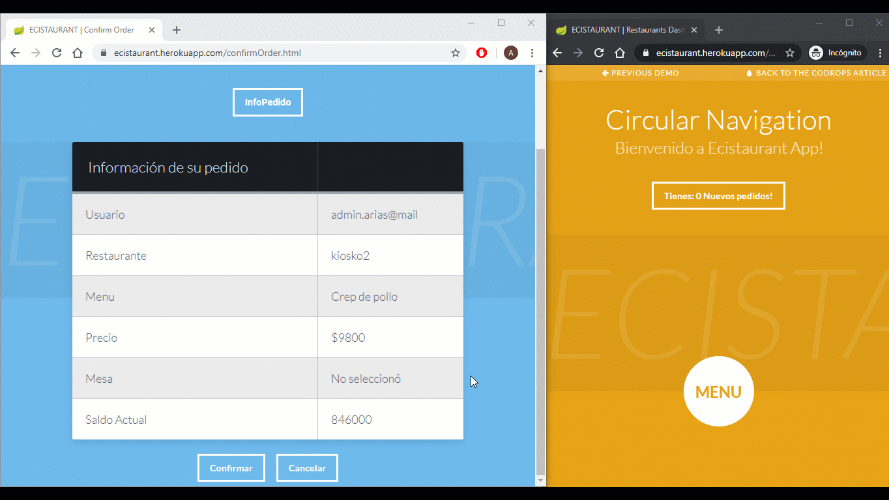
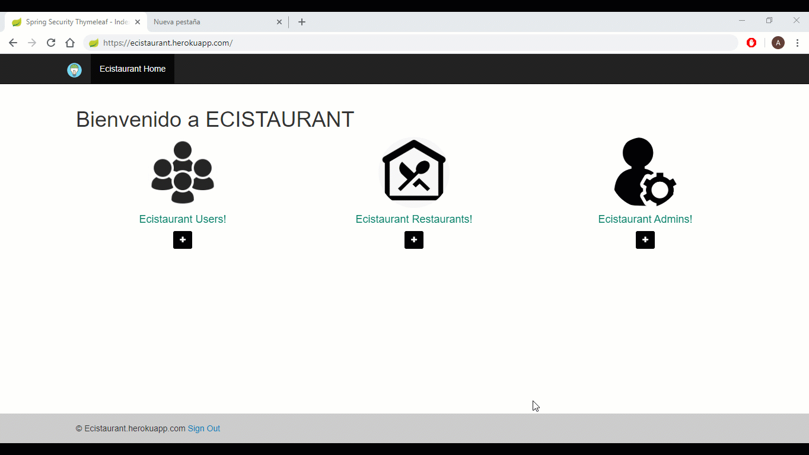

# Atributos no funcionales Ecistaurant

## Usabilidad

### Escenario 1

  Escenarios donde se le notifica al cliente sobre el estado actual de la aplicación

  ***"Visibility of system status"***
  
 * Cliente: Usuario que desea realizar un pedido.
 * Estimulo: Identificar si mi pedido fue aceptado/cancelado.
 * Artefactos: Frontend.
 * Ambiente: En condiciones normales de la aplicación.
 * Respuesta: Para los pedidos muestra alertas y paneles de confirmación.
 * Medida de respuesta:  Las alertas son mostradas en el navegador y cuentan con opciones de confirmación para poder continuar.
             
  #### Escenarios prácticos de la aplicación:

 
 
 
 
 
  ## Escalibilidad
  
  
  ## Disponibilidad
   
 * Cliente: Usuario final
 * Estimulo: Realizar un pedido o reservar una mesa.
 * Artefactos: Dyno Heroku.
 * Ambiente: En condiciones donde la aplicación esté recibiendo múltiples peticiones que puedan alterar el tráfico.
 * Respuesta: El Add-On de Heroku mantiene la aplicación sin ninguna alteración a la disponibilidad.
 * Medida de respuesta: Realizamos aproximadamente 3000 peticiones concurrentes, de las cuales ninguna falló.
                        A partir de las gráficas proporcionadas por "Librato Heroku".
                        
  ### Escenarios prácticos de la aplicación:
  

    
    

                         
  ## Rendimiento
  
  ### Escenario 1: 
  
 * Cliente: Usuario final de la aplicación, puede ser un cliente o un restaurante.
 * Estimulo: Consultar los restaurantes o pedidos dentro de la aplicación.
 * Artefactos: Base de datos y caché implementado.
 * Ambiente: En condiciones normales.
 * Respuesta: Mejora considerablemente la respuesta ante consultas que se hacian desde la base de datos.
 * Medida de respuesta: Realizamos peticiones con Postman y escenarios prácticos, en donde medimos el tiempo de respuesta
 en milisegundos.
 
 #### Escenarios prácticos de la aplicación:
  
  **Sin caché**
  
 **Tiempos de respuesta** : 
 
 * 669 ms (Calculado con la herramienta de desarrollo de Google).
        
 * 624 ms (Calculado con la herramienta Postman).
 
 
  
  
  
  **Con caché**
  
  **Tiempos de respuesta** : 
  
 * 111 ms (Calculado con la herramienta de desarrollo de Google).
  
 * 116 ms (Calculado con la herramienta Postman).
  
  
  
  
  
  
   ### Escenario 2:
   
 * Cliente: Usuarios y restaurantes de la aplicación.
 * Estimulo: Recibir notificaciones en tiempo real.
 * Artefactos: Servidores Frontend y WebSockets, Backend y bases de datos.
 * Ambiente: En condiciones normales.
 * Respuesta: Un cliente puede ver como cambia el estado de su pedido en tiempo real, de igual forma,
              un restaurante puede ver notificaciones en tiempo real cuando llegan nuevos pedidos.
 * Medida de respuesta: Realizamos pedidos y los atendimos para observar como cambiaban de estado en tiempo real.
 
 
  #### Escenarios prácticos de la aplicación:
  
  **Nota:** El cliente de la izquierda es un usuario y el de la derecha un restaurante.
  
 
 

  ### Escenario 3:
   
 * Cliente: Usuario final de la aplicación.
 * Estimulo: Consultar el estado actual de una mesa reservada.
 * Artefactos: Servidores Frontend y WebSockets, backend,  y bases de datos.
 * Ambiente: Cuando una mesa no está disponible. 
 * Respuesta: Un cliente puede observar el tiempo que le queda a una mesa para que esté disponible. Y puede reservarla al momento que acabe este timer.
 * Medida de respuesta: Reservamos una mesa con un estudiante y en la cuenta de otro usuario verificamos que el timer iniciara de forma adecuada.
                        De igual forma se verifica que la mesa se pueda reservar cuando el timer acaba.
                        
  #### Escenarios prácticos de la aplicación:
  
  **Nota:** El cliente de la izquierda es un estudiante al igual que el de la derecha.
  
  
 
 
 
  
  
 ## Seguridad
   
 * Cliente: Diferentes roles de los usuarios.
 * Estimulo: Verificar la seguridad de la aplicación a partir de los roles definidos.
 * Artefactos: Servidores Frontend Backend,  y bases de datos.
 * Ambiente: En condiciones normales.
 * Respuesta: Un usuario que intente entrar a la aplicación con un rol diferente al asignado será rechazado.
 * Medida de respuesta: Si si quiere ingresar con un rol diferente al asignado la aplicación responderá con un error HTTP 403 (Forbidden)
                        
  #### Escenarios prácticos de la aplicación:
  
  **Nota:** Para este ejemplo se intenta ingreasar como restaurante y como administrador con la cuenta de un estudiante.

 
 

 
 
