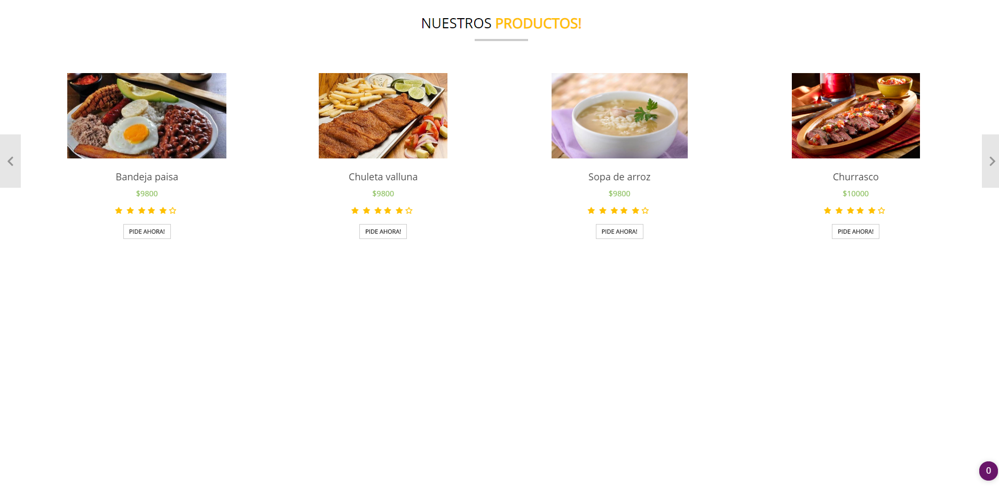

# Manual Ecistaurant
   
   
### Menú de Inicio
  Acá podemos observar la página de inicio de la aplicación, en donde podemos realizar el Log-In dependiendo de los usuarios
  que en este caso pueden ser tres, usuario, restuarante y administrador.
 

### Vistas para el usuario

  En esta vista nos encontramos con el Dashboard del usuario en donde puede consultar a los restaurantes en el carrusel desplegable.
  De igual forma puede realizar un Logout de la plataforma.
  
  
  
### Restaurantes Disponibles

  Acá podemos identificar los restaurantes disponibles dentro de nuestra aplicación, en los laterales de la página puede alternar
  entre restaurantes y en el botón amarillo puede redirigirse para observar los platos que ofrece cada restaurante.
  
  
  
### Menus Disponibles

  En esta vista podemos observar los diferentes platos ofrecidos por el restaurante seleccionado, cada uno tiene su nombre, foto y precio
  respectivo. El usuario puede pedir un plato en el botón correspondiente. En caso de que el usuario no cuente con el saldo suficiente
  se le indica que no puede pedir este plato, en caso de que su saldo sea mayor al precio del plato, se le pregunta si desea reservar una mesa.
  Si el usuario no quiere mesa se le redirecciona a la vista de confirmar pedido.
  
  
  
### Mesas

  Acá podemos apreciar todas las mesas de los diferentes restaurantes, cada mesa cuenta con un número de identificación, la ubicación y disponibilidad.
  En caso de que se quiera reservar una mesa no disponible se le indica al usuario, de igual forma cuando una mesa no está disponible,
  los usuarios pueden observar el tiempo restante que falta para que pase a estar disponible.
  
  
  
### Confirmar Pedido

   En esta parte se le muestra al cliente la información organizada del pedido que acaba de solicitar, se le pide al usuario confirmar la información
   para poder registrar el pedido, luego se le redirecciona a la vista que muestra el estado del pedido en tiempo real.
   
   
   
### Estado del pedido

   Por último, se le muestra al usuario el estado actual del pedido con notificaciones en tiempo real a través de una barra de progreso,
   la cual cambia dependiendo de las modificaciones que haga el restaurante al pedido del usuario.
   
   
   
### Vistas para el Restaurante
 
### Recepción de notificaciones de pedidos 

  A partir de esta vista el restaurante podrá ser notificado de nuevos pedidos realizados por los usuarios, clickeando sobre el botón
  "Pedidos" del carrusel desplegable será redireccionado a un panel en donde puede modificar el estado de los pedidos.
  
  

### Atender pedidos
  
  En esta vista el restaurante podrá modificar el estado del pedido. Cuando llega un pedido, será identificado como nuevo, luego pasará a
  pendiente y por último a completado.
  
   
   
   
   
  
  
  
  
  
  
  
  

