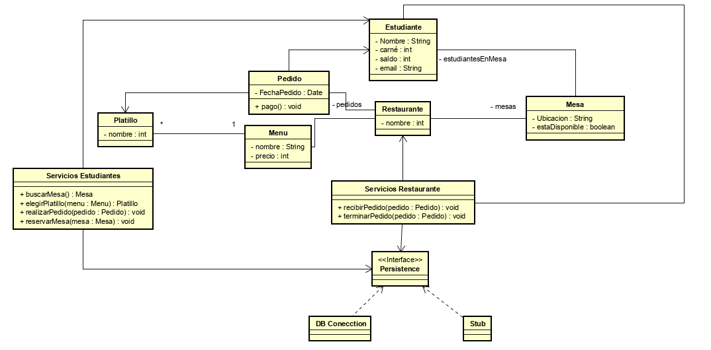
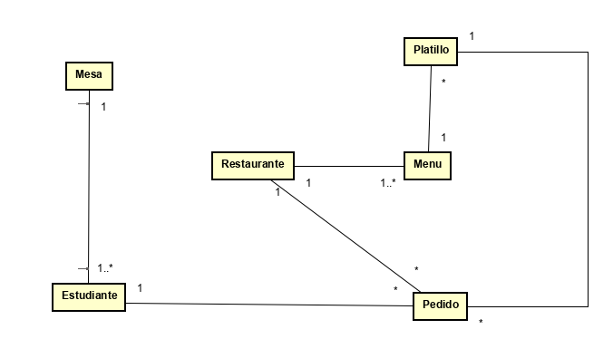
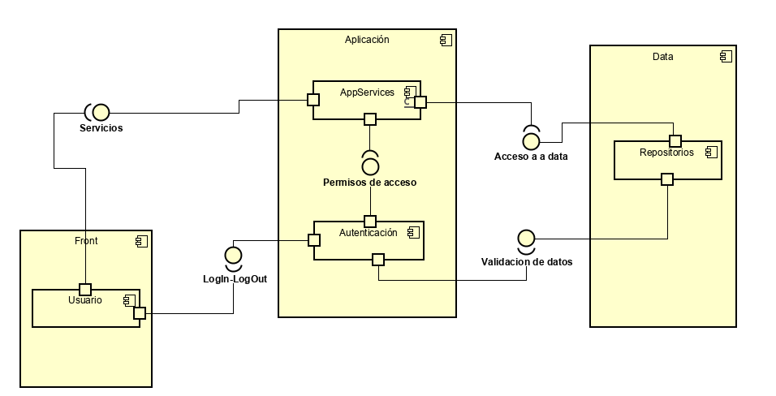
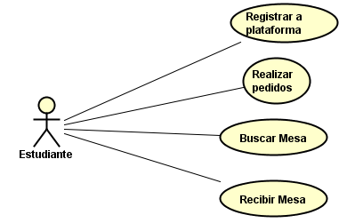
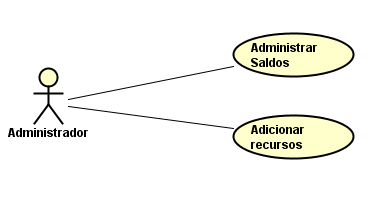
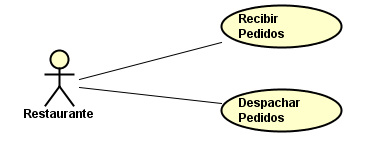

# ECI-STAURANT

Integrantes:
* Andres Felipe Marcelo
* Johan Sebastian Arias
* German Simon Marin

### Descripción (antecedentes, problema que se resuelve, etc.):
Diariamente, los estudiantes de la Escuela Colombiana de Ingenieria se enfrentan a entornos caoticos a la hora del almuerzo, pues se presentan extensas filas en los restaurantes, existe un acaparamiento de mesas del campus por parte de otros estudiantes que no emplean las mismas para comer.

Actualmente no existe una solucion para estas problematicas y como solución proponemos crear una aplicación web que permita administrar el manejo de las mesas de una manera mas óptima y el pedido de los almuerzos a travez de la aplicación.

#### Diagrama de clases

#### Diagrama Entidad-Relación

#### Componentes

A continuacion se presenta el diagrama de componentes

### Historias de usuario:

* COMO estudiante
QUIERO registrarme a la plataforma
PARA PODER disfrutar de los beneficios de esta. 

* COMO estudiante
QUIERO realizar pedidos
PARA PODER evitar filas en los horarios de almuerzo

  
* COMO estudiante
QUIERO buscar mesa
PARA PODER encontrar facilmente una mesa disponible para comer

* COMO estudiante
QUIERO recibir mesa
PARA PODER acceder facilmente una mesa disponible para comer

   
 
 
  
* COMO administrador
QUIERO administrar saldos
PARA PODER tener actualizada la información de los saldos de los clientes

* COMO administrador
  QUIERO administrar ecursos
  PARA PODER ampliar,eliminar y controlar  los recursos ofrecidos
 

* COMO restaurante
QUIERO recibir pedidos
PARA PODER agilizar manera de atender clientes

 

* COMO restaurante
QUIERO despachar pedidos
PARA PODER entregar el producto solicitado

### Mockups

Ver [Mockups](mockups)

### Backlog [Link backlog](https://tree.taiga.io/project/andresmarcelo7-eci-staurant-app/backlog)
